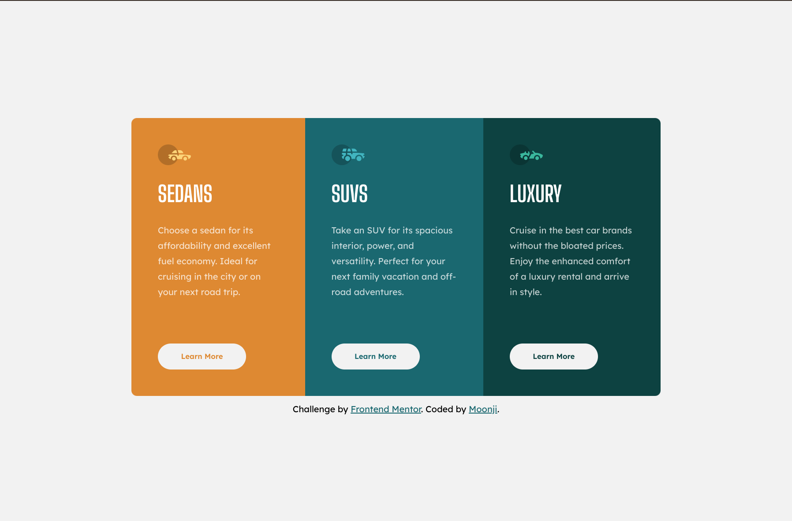

# Frontend Mentor - 3-column preview card component solution

This is a solution to the [3-column preview card component challenge on Frontend Mentor](https://www.frontendmentor.io/challenges/3column-preview-card-component-pH92eAR2-). Frontend Mentor challenges help you improve your coding skills by building realistic projects. 

## Table of contents

- [Overview](#overview)
  - [The challenge](#the-challenge)
  - [Screenshot](#screenshot)
  - [Links](#links)
- [My process](#my-process)
  - [Built with](#built-with)
  - [What I learned](#what-i-learned)
- [Author](#author)


## Overview

### The challenge

Users should be able to:

- View the optimal layout depending on their device's screen size
- See hover states for interactive elements

### Screenshot

<ins> Frontend Mentor's Desktop Design</ins>


<ins>My Desktop Solution</ins>



<ins>Frontend Mentor's Mobile Design</ins>


<ins>My Mobile Solution</ins>


### Links

- Solution URL: [Github](https://github.com/moonji-spoonji/Three-Column-Preview-Card-Component)
- Live Site URL: [Netlify](https://three-column-preview-card-moonji.netlify.app/)

## My process

### Built with

- Semantic HTML5 markup
- CSS custom properties
- Flexbox
- CSS Grid


### What I learned

#### CSS
I learned a method to make a colored background turn transparent when it is hovered. 

```css
button:hover {
  background-color: rgba(0, 0, 0, 0);
}
```


## Author

- Frontend Mentor - [@moonji-spoonji](https://www.frontendmentor.io/profile/moonji-spoonji)


